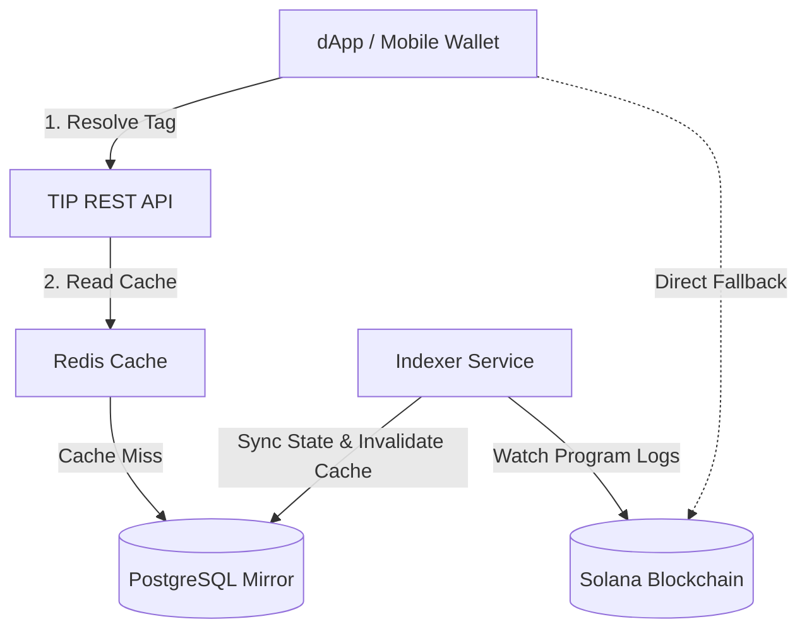

Welcome to the **Tagwise Identity Protocol (TIP)** documentation.

TIP is an open identity layer on Solana that maps short, human-readable handles (like `@alice` or `@dev`) to Solana wallet addresses and rich off-chain profile metadata. It simplifies user interactions, eliminates address copying errors in dApps, and powers instant cross-wallet payments.

---

## Why TIP?

- **Human-Readable Handles**: Pay `@alice` instead of verifying a 44-character base58 string like `4vcgrBuzoWw3kBanVTtx7Pi1v9WyTJBJQsFAQMqjJZjx`.
- **Zero Lock-In**: Solana Program Program Derived Addresses (PDAs) serve as the immutable source of truth. If the API is ever down, any dApp can resolve tags directly from the Solana cluster over standard RPC.
- **Off-Chain Speed & Rich Profiles**: Real-time indexing into a high-speed mirror powers instant search, profile avatars, bios, and preferred token metadata.
- **Non-Custodial & Wallet Auth**: Sign-In With Solana (SIWS) authentication ensures zero key exposure.
- **Multi-Asset & Solana Pay**: Built-in support for SOL and SPL token transfers, payment links, and QR codes.

---

## Architectural Principles

<Callout type="info" title="Source of Truth vs. Off-Chain Mirror">
  The Solana blockchain program (`tip_registry`) owns all tag registrations, ownership records, and destination payment wallets. The off-chain API service mirrors on-chain state to provide sub-millisecond response times and rich metadata.
</Callout>

---

## Documentation Roadmap

Explore the sections below to integrate TIP into your application:

<Cards>
  <Card title="Concepts" href="/docs/concepts">
    Understand the dual-layer architecture, PDA account storage, 3-tier moderation, and security model.
  </Card>
  <Card title="Quickstart" href="/docs/quickstart">
    Get up and running with `@tagwise/tip-sdk` in under 5 minutes.
  </Card>
  <Card title="Integration Guides" href="/docs/integration-guides">
    Learn how to register tags, update profiles, authenticate wallets, and generate Solana Pay QR codes.
  </Card>
  <Card title="SDK Reference" href="/docs/sdk-reference">
    Detailed reference documentation for every class, function, parameter, and error in `@tagwise/tip-sdk`.
  </Card>
  <Card title="REST API Reference" href="/docs/api-reference">
    OpenAPI HTTP endpoint documentation for direct server-to-server integrations.
  </Card>
</Cards>
